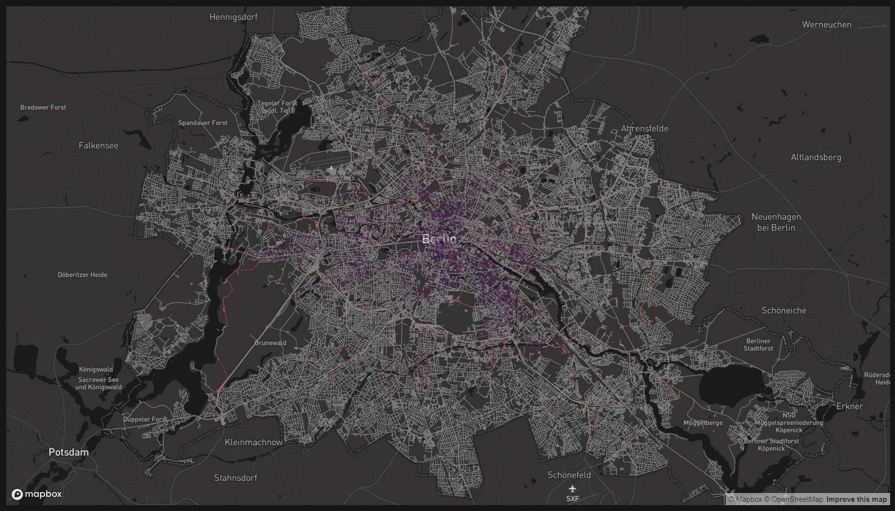

> TODO: Source

## Load

```{r}
uber_06 <- geojson_sf("geodata/uber_201904-06_speed.json")
```

```{r eval=FALSE}
uber_06_berlin <- uber_06 %>% 
    sf::st_crop(berlin_sf) %>% 
  sf::st_intersection(berlin_sf)
# save(file = "outputs/uber_06_berlin.RData", uber_06_berlin)
```

```{r eval=FALSE, echo=FALSE, include=FALSE}
load(file = "outputs/uber_06_berlin.RData")
```

## Inspect

```{r}
skimr::skim(uber_06_berlin)
```

## Preview

> Caution: 254K rides; have RAM and/or use mapdeck / deck.gl or subset

```{r eval=FALSE}
mapdeckmap <- mapdeck(style = mapdeck_style("dark"))
add_sf(map = mapdeckmap, data = uber_06_berlin,
       stroke_colour = "speed_mean_kph",
       palette = "inferno",
       stroke_width = 5)
```



```{r eval=FALSE}
geojsonio::geojson_write(uber_06_berlin, file = "outputs/export_test_uber.geojson", encoding = "UTF-8")
```

