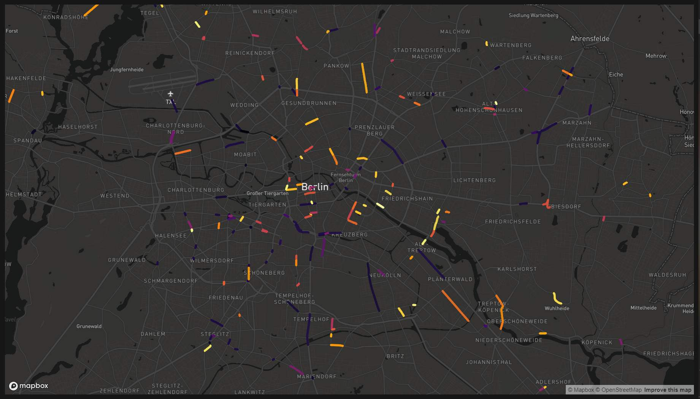

> TODO: Source - FixMyBerlin

> To enable the demo, we only include segments with happy bike valies of less than 5.

### Load & Calculate Lengths

```{r}
close_gap <- sf::read_sf("geodata/fixmyberlin_final_7.geojson")

close_gap <- close_gap %>%
  filter(happy_bike_index < 5) %>%
  st_transform(crs = 3857) %>%
  mutate(length_m = as.integer(sf::st_length(st_geometry(.)))) %>% 
  st_transform(crs = 4326)
  
# save(close_gap, file ="outputs/data_close_gap_raw.RData")
```

```{r eval=FALSE, include=FALSE, echo=FALSE}
load(file ="outputs/data_close_gap_raw.RData") # returns close_gap
```

### Inspect Data

```{r}
close_gap %>% skimr::skim()
```


### Preview

> omit from repo to not expose the mapbox key
> serve screenshot instead

```{r eval=FALSE}
mapdeckmap <- mapdeck(style = mapdeck_style("dark"))
add_sf(map = mapdeckmap, data = close_gap,
       stroke_colour = "happy_bike_index",
       palette = "inferno",
       stroke_width = 100)
```



```{r}
close_gap %>% 
  names()
```

> Toy subset

### Worst 10 Lichtenberg Sample for Testing

```{r}
close_gap %>% 
  mapview::mapview()
```

```{r}
close_gap_10 <- close_gap %>% 
  filter(bezirk == "Lichtenberg") %>% 
  arrange(happy_bike_index) %>% 
  select(-details) %>% 
  head(10)
```

```{r}
head(close_gap_10)
```

> Export for Web
> Critical to force-encode file as UTF-8 (because we have German special characters)

```{r}
geojsonio::geojson_write(close_gap_10,
                         file = "outputs/export_test_close_gap_10_a.geojson",
                         encoding = "UTF-8")
```


