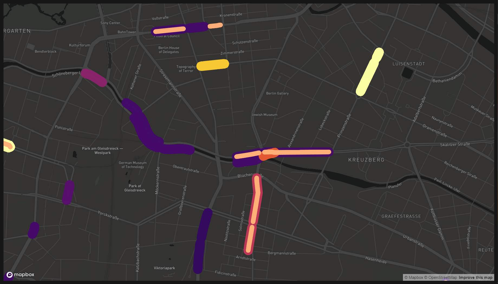

## Import Layers

```{r}
load(file = "outputs/final_full_base.RData")
load(file = "outputs/final_full_index.RData")
```

```{r eval=FALSE}
mapdeck(style = mapdeck_style("dark"), zoom = 0) %>% 
  add_sf(data = close_gapbase, stroke_colour = "happy_bike_index",
         palette = "heat", stroke_width = 20, layer_id = "base") %>%
  add_sf(data = close_gapindex, stroke_colour = "index",
         palette = "ylorrd", stroke_width = 100, layer_id = "index")
```



