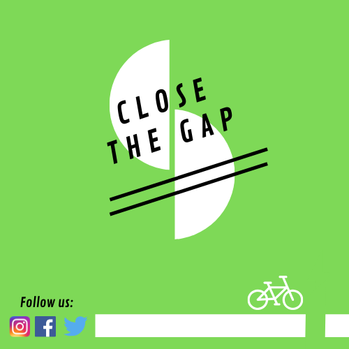
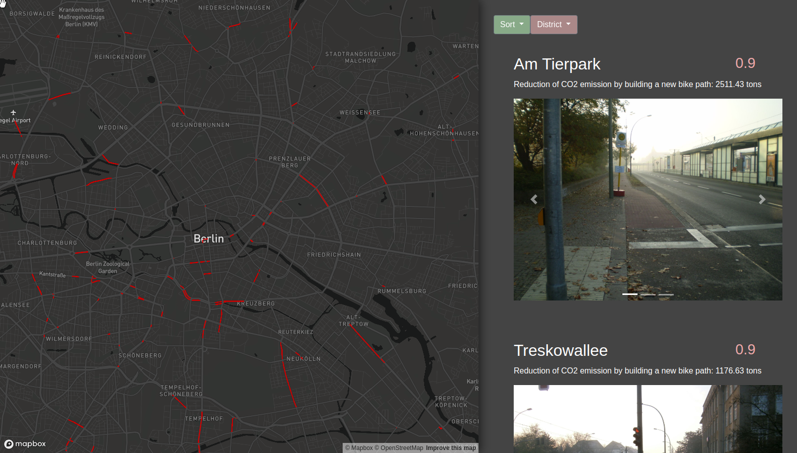

# Climathon 2019 - Team "Close the Gap"

A collection of all the things we've worked on, the data we mined and the software we created.

## What's the plan?

We wanted to find the worst bike paths located in Berlin by crunching through several datasets with multiple metrics. Bike paths were rated by an index calculated using air quality measurements, traffic measurements and quality state of the street.

## What did we use?

Using the Air quality metrics we were also able to calculate roughly how much CO2 emissions could be saved by replacing busy streets with a bike path (Not really a useful metric since the cars wouldn't just disappear, but still an interesting one.)

We used the Geodata to display the bike paths with a quality index less than 3 in an interactive map.

## What does it look like?

## Conclusion.

We all had incredibly much fun working through this for 24 hours. It's amazing how much we all learned and at what a high level our teamwork was operating.

## Thanks to:

Marc and Manuel for keeping the team on track, reminding us to recap our thoughts and doings, and successfully (!) pitching our concept. Management was very important for us all to keep going in the same direction.

Ilja, Kathi and Carl for making the huge datasets accessible and easy to work with.

Kai for non-stop mining geojsons, exploring and documenting APIs, and setting up and operating an AWS instance.

Leo for engineering the web app, and speed-learning deck.gl after after last-minute specs changes.

And Ann-Kathrin who kept us from starving when we zoned out, for the cool logo she made, and boosting our morale.
